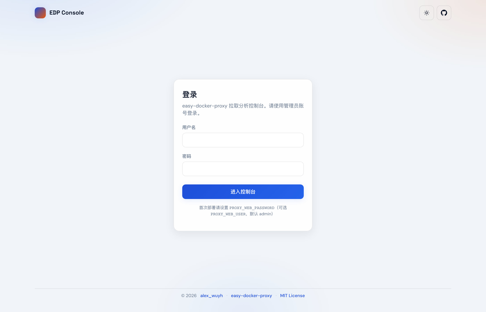
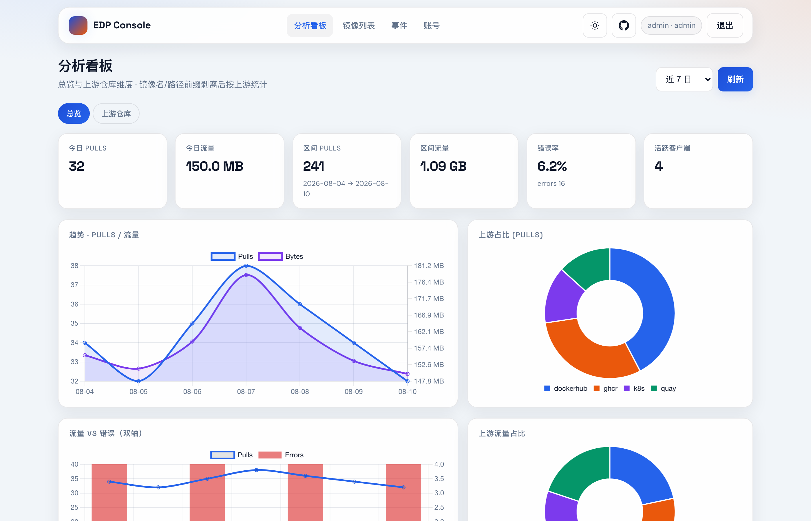
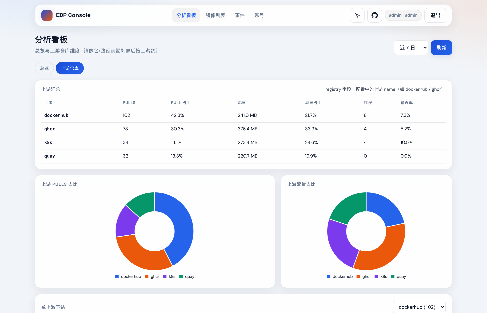
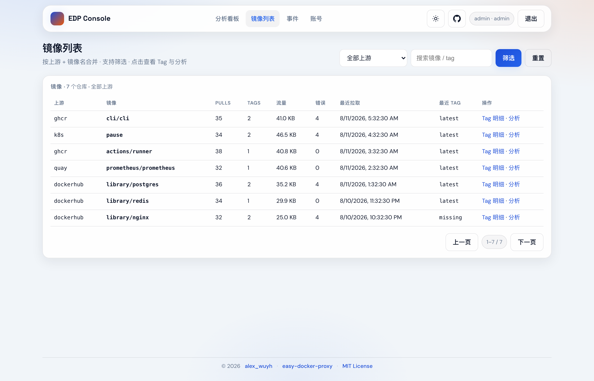
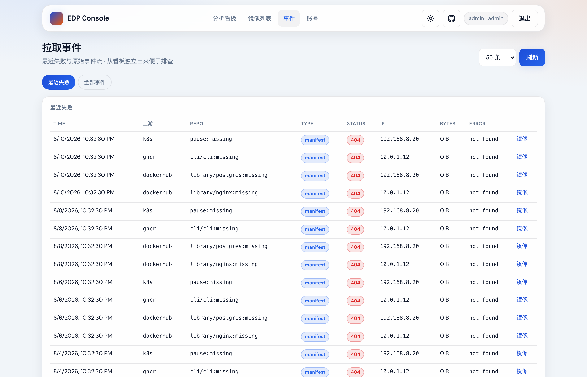

# easy-docker-proxy

**English** | [中文](./README.zh-CN.md)

Lightweight **multi-upstream Docker Registry proxy**.

- Streaming pull-through — **no image layer cache**
- Pull records and a simple Stats web UI
- Single **your own domain** entry via **registry-mirrors + path prefixes**
- No Docker socket, no container management

> **About domains in this docs**  
> Names like `reg.a.c`, `reg.example.com`, and `https://reg.a.c` are **examples only**.  
> Before production use: (1) register a domain, (2) point A/AAAA (or CNAME) at the proxy host, (3) put the **real hostname** in Caddy/Nginx and in `config.yaml` → `hosts`.

Full install and configuration (currently in Chinese): **[docs/install.md](./docs/install.md)**.

---

## Screenshots

Stats console (demo data). Click for full size.

| Login | Dashboard |
|:-----:|:---------:|
|  |  |

| Upstream analytics | Images |
|:------------------:|:------:|
|  |  |

<p align="center">
  
</p>

---

## Quick deploy

```bash
git clone https://github.com/AlexWuYh/easy-docker-proxy.git
cd easy-docker-proxy

cp .env.example .env
# Set PROXY_ADMIN_TOKEN and PROXY_WEB_PASSWORD

cp configs/config.docker.yaml configs/config.yaml
# Replace hosts: reg.example.com with your real domain

docker compose -f deploy/docker-compose.yaml up -d --build
```

| Item | Detail |
|------|--------|
| Data plane | Host **:5000** (not 80/443) |
| Admin plane | **:5001**, not published publicly by default |
| HTTPS | Prefer your existing Caddy → `127.0.0.1:5000` |
| Stats UI | Map `127.0.0.1:5001`, open `/stats/login.html` |

Ops and security notes: [deploy/README.md](./deploy/README.md).

---

## Client usage

Replace **`reg.a.c`** with your domain everywhere below.

### 1. Docker Hub (registry-mirrors, no path prefix)

```json
// /etc/docker/daemon.json
{
  "registry-mirrors": ["https://reg.a.c"]
}
```

```bash
systemctl restart docker   # Linux
docker pull nginx:alpine
```

For plain HTTP endpoints, also set `insecure-registries`.

### 2. Other upstreams (path prefix on the same domain)

```bash
docker pull reg.a.c/ghcr.io/owner/app:tag
docker pull reg.a.c/quay.io/prometheus/prometheus:latest
docker pull reg.a.c/docker.io/library/nginx:latest
docker pull reg.a.c/registry.k8s.io/pause:3.9
```

The proxy picks the upstream from the path prefix and **strips the prefix** before calling the real registry.  
**Do not** hijack official names like `ghcr.io` via `/etc/hosts` (TLS certificate mismatch).

---

## Supported upstreams

Default config: [configs/config.docker.yaml](./configs/config.docker.yaml).

Path-prefix form:

```text
docker pull <your-domain>/<path-prefix>/...
```

Docker Hub can also use mirrors with no prefix: `docker pull nginx`.

| name | Upstream | Path prefix | Pull example | Auth env (optional) |
|------|----------|-------------|--------------|---------------------|
| `dockerhub` | Docker Hub | `docker.io` + mirrors (no prefix) | `nginx` or `<dom>/docker.io/library/nginx:latest` | `DOCKERHUB_USER` / `DOCKERHUB_TOKEN` |
| `ghcr` | GHCR | `ghcr.io` | `<dom>/ghcr.io/owner/app:tag` | `GITHUB_USER` / `GITHUB_TOKEN` |
| `quay` | Quay.io | `quay.io` | `<dom>/quay.io/org/img:tag` | `QUAY_USER` / `QUAY_TOKEN` |
| `gcr` | GCR | `gcr.io` | `<dom>/gcr.io/project/img:tag` | `GCR_USER` / `GCR_TOKEN` |
| `k8s` | Kubernetes | `registry.k8s.io`, `k8s.gcr.io` | `<dom>/registry.k8s.io/pause:3.9` | anonymous by default |
| `mcr` | Microsoft MCR | `mcr.microsoft.com` | `<dom>/mcr.microsoft.com/...` | anonymous by default |
| `nvcr` | NVIDIA NGC | `nvcr.io` | `<dom>/nvcr.io/...` | `NVCR_USER` / `NVCR_TOKEN` |
| `elastic` | Elastic | `docker.elastic.co` | `<dom>/docker.elastic.co/...` | `ELASTIC_USER` / `ELASTIC_TOKEN` |
| `ecr-public` | AWS Public ECR | `public.ecr.aws` | `<dom>/public.ecr.aws/...` | anonymous by default |

- Env template: [.env.example](./.env.example). **Empty = public anonymous**; set tokens for private pulls or Hub rate limits.  
- Set `enabled: false` to disable an upstream, or add your own `registries` entry.  
- Field reference: [docs/install.md](./docs/install.md) (Chinese).

---

## Docs

| Doc | Content |
|-----|---------|
| [README.zh-CN.md](./README.zh-CN.md) | Chinese README |
| [docs/install.md](./docs/install.md) | Install, config, Caddy, checklist, FAQ (Chinese) |
| [deploy/README.md](./deploy/README.md) | Deploy architecture, security, backup (Chinese) |
| [configs/config.example.yaml](./configs/config.example.yaml) | Local config template |

---

## Development

```bash
export PROXY_ADMIN_TOKEN="$(openssl rand -hex 32)"
export PROXY_WEB_PASSWORD='your-long-password'
go run ./cmd/proxy -config configs/config.example.yaml
CGO_ENABLED=0 go test ./...
```

---

## Acknowledgments / License

Data-plane ideas inspired by [Docker-Proxy](https://github.com/dqzboy/Docker-Proxy) (not a fork; no container management).

[MIT](./LICENSE)
